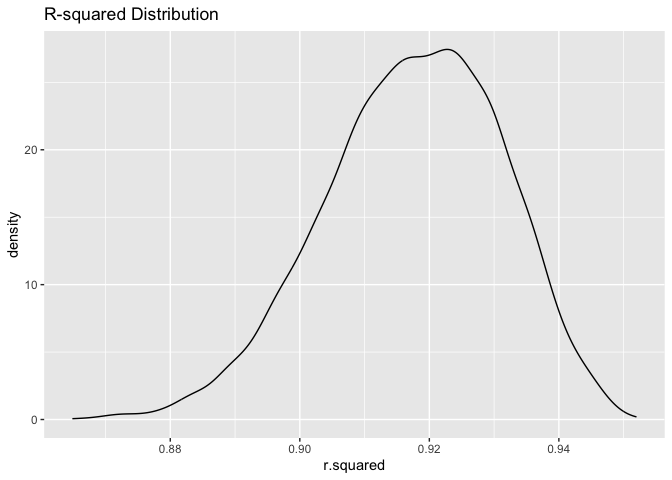
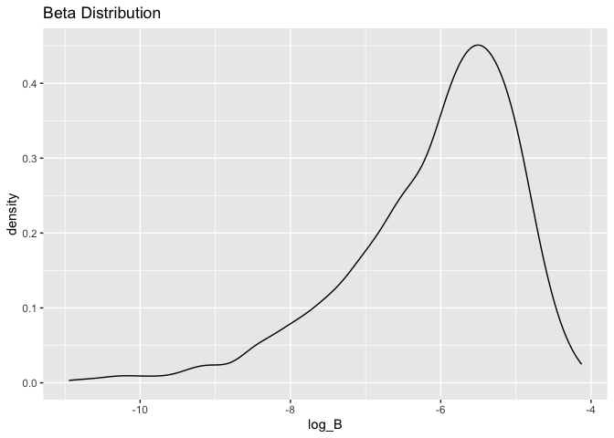
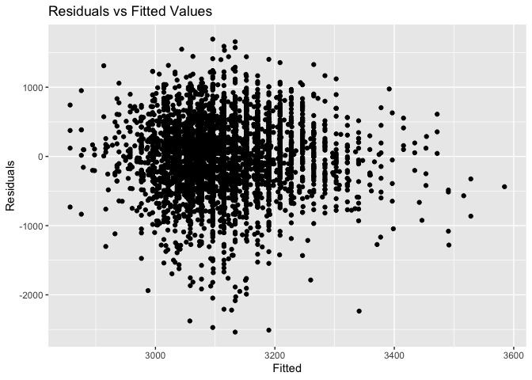
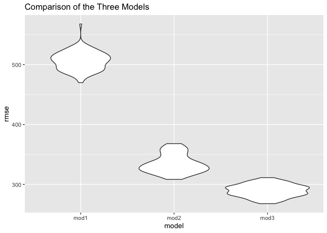

hw6
================
2023-11-28

Load necessary packages

``` r
library(tidyverse)
```

    ## ── Attaching core tidyverse packages ──────────────────────── tidyverse 2.0.0 ──
    ## ✔ dplyr     1.1.3     ✔ readr     2.1.4
    ## ✔ forcats   1.0.0     ✔ stringr   1.5.0
    ## ✔ ggplot2   3.4.3     ✔ tibble    3.2.1
    ## ✔ lubridate 1.9.2     ✔ tidyr     1.3.0
    ## ✔ purrr     1.0.2     
    ## ── Conflicts ────────────────────────────────────────── tidyverse_conflicts() ──
    ## ✖ dplyr::filter() masks stats::filter()
    ## ✖ dplyr::lag()    masks stats::lag()
    ## ℹ Use the conflicted package (<http://conflicted.r-lib.org/>) to force all conflicts to become errors

``` r
library(modelr)
library(purrr)
set.seed(1)
```

## problem 1 (0 points)

``` r
## no work shown for this problem 
```

## problem 2

Run code chunk from the course website:

``` r
weather_df = 
  rnoaa::meteo_pull_monitors(
    c("USW00094728"),
    var = c("PRCP", "TMIN", "TMAX"), 
    date_min = "2022-01-01",
    date_max = "2022-12-31") |>
  mutate(
    name = recode(id, USW00094728 = "CentralPark_NY"),
    tmin = tmin / 10,
    tmax = tmax / 10) |>
  select(name, id, everything())
```

    ## using cached file: /Users/wynterhenry/Library/Caches/org.R-project.R/R/rnoaa/noaa_ghcnd/USW00094728.dly

    ## date created (size, mb): 2023-09-28 10:06:27 (8.524)

    ## file min/max dates: 1869-01-01 / 2023-09-30

Use 5000 bootstrap samples and, for each bootstrap sample, produce
estimates of these two quantities. Plot the distribution of your
estimates, and describe these in words. Using the 5000 bootstrap
estimates, identify the 2.5% and 97.5% quantiles to provide a 95%
confidence interval for r̂ 2 and log(β̂ 0∗β̂ 1)

``` r
boot_straps = 
  weather_df |> 
  modelr::bootstrap(n = 5000)

boot_straps |> pull(strap) |> nth(1)
```

    ## <resample [365 x 6]> 324, 167, 129, 299, 270, 187, 307, 85, 277, 362, ...

Drawing 5000 samples and establishing the 95% CI:

``` r
boot_straps = 
  weather_df |> 
  modelr::bootstrap(n = 5000)|> 
  mutate(
    models = map(.x = strap, ~lm(tmax ~ tmin + prcp, data = .x)), 
    results = map(models, broom::tidy)) |> 
  select(-strap, -models) |> 
  unnest(results) |> 
  group_by(term) |> 
  select(.id, term, estimate) |>
  pivot_wider(
    names_from = "term",
    values_from = "estimate"
  ) |> 
  janitor::clean_names() |>
  filter(tmin*prcp > 0) |> 
  mutate(
    log_B = log(tmin*prcp) 
  ) |> 
  summarize(
    LL = quantile(log_B, c(.025), na.rm = TRUE),
    UL = quantile(log_B, c(.975), na.rm = TRUE) 
   )
```

Finding R^2:

``` r
boot_straps = 
  weather_df |> 
  modelr::bootstrap(n = 5000) |> 
  mutate(
    models = map(strap, ~lm(tmax ~ tmin + prcp, data = .x)),
    results = map(models, broom::glance)
  ) |> 
  select(-strap, -models) |> 
  unnest(results) |> 
  janitor::clean_names() |> 
  summarize(
    LL = quantile(r_squared, c(.025)),
    UL = quantile(r_squared, c(.975)) 
  )
```

Plots:

``` r
## r squared plot 

weather_df |> 
  modelr::bootstrap(n = 5000) |> 
  mutate(
    models = map(strap, ~lm(tmax ~ tmin + prcp, data = .x)),
    results = map(models, broom::glance)
  ) |> 
  select(-strap, -models) |> 
  unnest(results) |> 
  ggplot(aes(x = r.squared)) + geom_density() +
  labs(
    title = "R-squared Distribution"
  )
```

<!-- -->

The distribution of R-squared appears to be normal, based on the shape
of the graph. It is centered around 0.92, which suggests that about 92%
of the variance is explained by the model. The 95% confidence interval
for R-squared is given by the ‘summarize(LL = quantile(r_squared,
c(.025)),UL = quantile(r_squared, c(.975)))’ line and is (0.888,0.941).

``` r
## log plot 

  weather_df |> 
  modelr::bootstrap(n = 5000)|> 
  mutate(
    models = map(.x = strap, ~lm(tmax ~ tmin + prcp, data = .x)), 
    results = map(models, broom::tidy)) |> 
  select(-strap, -models) |> 
  unnest(results) |> 
  group_by(term) |> 
  select(.id, term, estimate) |>
  pivot_wider(
    names_from = "term",
    values_from = "estimate"
  ) |> 
  janitor::clean_names() |>
  filter(tmin*prcp > 0) |> 
  mutate(
    log_B = log(tmin*prcp) 
  ) |> ggplot(aes(x = log_B)) + geom_density() +
  labs(
    title = "Beta Distribution"
  )
```

<!-- -->

The distribution of the variable I called ‘log_B’ appears to also be
normally distributed but with a negative skew and is centered around -5.
The 95% confidence interval for log_B is given by the ’summarize(LL =
quantile(log_B, c(.025), na.rm = TRUE),UL = quantile(log_B, c(.975),
na.rm = TRUE)) line and is also (0.888,0.941)

## problem 3

Load and clean the data for regression analysis:

``` r
birthweight_data = 
  read_csv("birthweight.csv") |>  
  janitor::clean_names() |> 
  mutate(
    babysex = as.factor(babysex),
    frace = as.factor(frace),
    malform = as.factor(malform),
    mrace = as.factor(mrace)
  )
```

    ## Rows: 4342 Columns: 20
    ## ── Column specification ────────────────────────────────────────────────────────
    ## Delimiter: ","
    ## dbl (20): babysex, bhead, blength, bwt, delwt, fincome, frace, gaweeks, malf...
    ## 
    ## ℹ Use `spec()` to retrieve the full column specification for this data.
    ## ℹ Specify the column types or set `show_col_types = FALSE` to quiet this message.

``` r
#nrow(birthweight_data)
#ncol(birthweight_data)
```

There are no missing rows or columns in this dataset.

Propose a regression model for birthweight:

``` r
fit_birthweight = lm(bwt ~ smoken + pnumlbw + momage, data = birthweight_data)
fit_birthweight |>  broom::tidy()
```

    ## # A tibble: 4 × 5
    ##   term        estimate std.error statistic   p.value
    ##   <chr>          <dbl>     <dbl>     <dbl>     <dbl>
    ## 1 (Intercept)  2758.       40.9      67.4   0       
    ## 2 smoken         -5.97      1.04     -5.75  9.68e- 9
    ## 3 pnumlbw        NA        NA        NA    NA       
    ## 4 momage         18.8       1.98      9.47  4.50e-21

I chose these variables for my model because I wanted to see how
variables I was not familiar with affect birth weight. I already knew
that smoking during pregnancy increases the risk of a newborn having a
low birth weight, but I did not have any prior knowledge about how
previous low birth weights and age of the mother at birth affected birth
weight, if at all. Because of this, I wanted to explore the relationship
these variables have with birth weight.

Show a plot of model residuals against fitted values – use
add_predictions and add_residuals in making this plot:

``` r
birthweight_data |>  
  modelr::add_residuals(fit_birthweight) |> 
  modelr::add_predictions(fit_birthweight) |>  
  ggplot(aes(x = pred, y = resid)) + 
  geom_point() +
  labs(
    title = "Residuals vs Fitted Values",
    x = "Fitted",
    y = "Residuals"
    ) 
```

    ## Warning in predict.lm(model, data): prediction from a rank-deficient fit may be
    ## misleading

    ## Warning in predict.lm(model, data): prediction from a rank-deficient fit may be
    ## misleading

<!-- -->

Compare your model to two others:

``` r
fit_birthweight2 = lm(bwt ~ + blength + gaweeks, data = birthweight_data)

fit_birthweight3 = lm(bwt ~ bhead + bhead * blength * babysex, data = birthweight_data) 
```

Make this comparison in terms of the cross-validated prediction error;
use crossv_mc and functions in purrr as appropriate:

``` r
cv_df = 
  crossv_mc(birthweight_data, 100) |> 
  mutate(
    train = map(train, as_tibble),
    test = map(test, as_tibble)
  )
```

``` r
cv_df = 
  cv_df |>  
  mutate(
   mod_1 = map(.x = train, ~lm(bwt ~ smoken + pnumlbw + momage, data = .x)),
   mod_2 = map(.x = train, ~lm(bwt ~ + blength + gaweeks, data = .x)),
   mod_3 = map(.x = train, ~lm(bwt ~ bhead + bhead * blength * babysex, data = .x))
  ) |>  
  mutate(
    rmse_mod1 = map2_dbl(mod_1, .y = test, ~rmse(model = .x, data = .y)),
    rmse_mod2 = map2_dbl(mod_2, .y = test, ~rmse(model = .x, data = .y)),
    rmse_mod3 = map2_dbl(mod_3, .y = test, ~rmse(model = .x, data = .y))
  )
```

    ## Warning: There were 100 warnings in `mutate()`.
    ## The first warning was:
    ## ℹ In argument: `rmse_mod1 = map2_dbl(mod_1, .y = test, ~rmse(model = .x, data =
    ##   .y))`.
    ## Caused by warning in `predict.lm()`:
    ## ! prediction from a rank-deficient fit may be misleading
    ## ℹ Run `dplyr::last_dplyr_warnings()` to see the 99 remaining warnings.

``` r
cv_df |> 
  select(starts_with("rmse")) |> 
  pivot_longer(
    everything(),
    names_to = "model", 
    values_to = "rmse",
    names_prefix = "rmse_") |> 
  mutate(model = fct_inorder(model)) |> 
  ggplot(aes(x = model, y = rmse)) + geom_violin() +
  labs(
    title = "Comparison of the Three Models"
    ) 
```

<!-- -->
